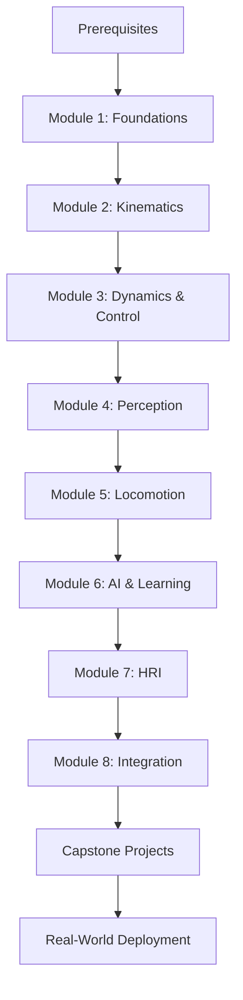

# Physical AI & Humanoid Robotics

## A Comprehensive Course on Humanoid Robotics, AI, and Embodied Intelligence

Welcome to the definitive course on **Physical AI & Humanoid Robotics**! This comprehensive, professional-level course provides 180 hours of theoretical foundations, hands-on labs, and capstone projects designed to transform you into a robotics engineer capable of designing, implementing, and deploying humanoid robot systems.

---

## 🎯 What You'll Learn

This course covers the complete spectrum of humanoid robotics, from mathematical foundations to cutting-edge AI techniques:

### Core Competencies

- **Mathematical Foundations**: Linear algebra, kinematics, dynamics, and control theory
- **Robot Programming**: ROS2, Python, C++ for robotics applications
- **Perception Systems**: Computer vision, SLAM, sensor fusion, and 3D processing
- **Locomotion**: Bipedal walking, balance control, and dynamic movement
- **AI & Machine Learning**: Reinforcement learning, imitation learning, and embodied AI
- **Human-Robot Interaction**: Speech, gestures, and collaborative tasks
- **System Integration**: Full-stack robotics with real-world deployment considerations

---

## 📚 Course Structure

The course is organized into **8 modules** comprising **36 chapters** and **36 hands-on labs**:

### Module 1: Foundations of Physical AI
Introduction to embodied AI, mathematical foundations, robot anatomy, and ROS2 architecture.

**Duration**: 22-28 hours | **Chapters**: 4 | **Labs**: 4

### Module 2: Robot Kinematics and Motion Planning
Forward and inverse kinematics, trajectory planning, motion planning algorithms, and whole-body control.

**Duration**: 28-34 hours | **Chapters**: 5 | **Labs**: 5

### Module 3: Dynamics and Control
Rigid body dynamics, control theory, advanced control techniques, force control, and real-time systems.

**Duration**: 26-32 hours | **Chapters**: 5 | **Labs**: 5

### Module 4: Perception and Sensor Processing
Computer vision, object detection, SLAM, sensor fusion, and point cloud processing.

**Duration**: 30-38 hours | **Chapters**: 5 | **Labs**: 5

### Module 5: Bipedal Locomotion
Fundamentals of bipedal robots, walking controllers, balance control, terrain adaptation, and dynamic locomotion.

**Duration**: 25-31 hours | **Chapters**: 5 | **Labs**: 5

### Module 6: AI and Machine Learning
Machine learning fundamentals, reinforcement learning, deep RL, imitation learning, and model-based RL.

**Duration**: 30-40 hours | **Chapters**: 5 | **Labs**: 5

### Module 7: Human-Robot Interaction
HRI fundamentals, speech and NLP, gesture recognition, and collaborative task execution.

**Duration**: 18-24 hours | **Chapters**: 4 | **Labs**: 4

### Module 8: Integration and Capstone Projects
System architecture, testing, ethics, and **three comprehensive capstone projects**.

**Duration**: 21-27 hours | **Chapters**: 3 + 3 Projects | **Labs**: 3

---

## 🎓 Who Is This Course For?

### Primary Audience

- **University Students**: Senior undergraduates and graduate students in robotics, computer science, mechanical engineering, or AI
- **Professional Engineers**: Software, robotics, or AI engineers transitioning into humanoid robotics
- **Researchers**: Academic or industry researchers looking to deepen expertise in embodied AI

### Prerequisites

While the course provides refresher materials, students should have:

- **Programming**: Intermediate Python; basic C++ helpful
- **Mathematics**: Linear algebra, calculus, probability (undergraduate level)
- **Basic Robotics**: Familiarity with coordinate frames, sensors, actuators (helpful but not required)

📝 **Start with our [Prerequisites Assessment](prerequisites/)** to gauge your readiness.

---

## 🛠️ Tools & Technologies

### Software Stack

- **ROS2 Humble LTS**: Robot Operating System 2
- **Simulation**: PyBullet, Webots, MuJoCo, Gazebo
- **AI/ML**: PyTorch, TensorFlow, Stable-Baselines3
- **Computer Vision**: OpenCV, MediaPipe, YOLO, Open3D
- **Development**: Docker, Git, VS Code/PyCharm

### Hardware (Optional)

While the course is **simulation-based**, students with access to robotics hardware can deploy learned techniques to:

- Wheeled mobile robots (TurtleBot, ROSbot)
- Robotic arms (UR5, Franka Panda)
- Humanoid platforms (NAO, Pepper, custom builds)

---

## 📋 Learning Approach

### Pedagogical Philosophy

1. **Theory → Practice → Application**: Each chapter introduces concepts, followed by hands-on labs and cumulative projects
2. **Complete, Runnable Code**: All code examples include full solutions AND scaffolded versions for guided learning
3. **Progressive Complexity**: Concepts build incrementally from foundations to advanced topics
4. **Real-World Focus**: Labs use industry-standard tools and simulate real robotics challenges

### Assessment Strategy

- **Automated Quizzes**: Instant feedback on conceptual understanding (end of each module)
- **Hands-On Labs**: 36 practical labs with guided exercises and verification tests
- **Capstone Projects**: 3 comprehensive projects demonstrating mastery

---

## 🚀 Getting Started

### Step 1: Check Prerequisites

Complete the [Prerequisites Self-Assessment](prerequisites/) to identify any knowledge gaps.

### Step 2: Set Up Your Environment

Follow the [Environment Setup Lab](labs/lab-01-environment-setup/) to install ROS2, simulation tools, and development environment.

### Step 3: Begin Module 1

Start your journey with [Module 1: Foundations of Physical AI](module-01-foundations/).

---

## 📖 Course Resources

### Supplementary Materials

- **[Glossary](glossary)**: 40+ technical terms with clear definitions
- **[Datasets](resources/datasets)**: Curated datasets for robotics and perception
- **[Research Papers](resources/research-papers)**: 50+ foundational and cutting-edge papers
- **[External Resources](resources/external-resources)**: Books, courses, and documentation
- **[Troubleshooting](resources/troubleshooting)**: Common issues and solutions

### Community & Support

- **GitHub Discussions**: Ask questions, share projects, collaborate with peers
- **Issue Tracker**: Report bugs, suggest improvements
- **Contributing**: Help improve the course content

---

## 📄 License & Attribution

**License**: Creative Commons Attribution-NonCommercial-ShareAlike 4.0 International (CC BY-NC-SA 4.0)

**You are free to**:
- Share and adapt the material for non-commercial purposes
- Must give appropriate credit and indicate changes

**Developed by**: The Physical AI & Humanoid Robotics Course Team

---

## 🎯 Course Outcomes

Upon completion, you will be able to:

✅ **Design** kinematic and dynamic models for humanoid robots
✅ **Implement** bipedal walking controllers with balance and recovery
✅ **Develop** perception systems using computer vision and sensor fusion
✅ **Train** robots using reinforcement and imitation learning
✅ **Build** full-stack robotics systems integrating perception, planning, and control
✅ **Deploy** humanoid robots for real-world service, research, or industrial applications

---

## 🗺️ Learning Roadmap

---

## 📞 Contact & Feedback

Have questions or feedback? We'd love to hear from you!

- **Issues**: [GitHub Issues](https://github.com/your-org/humanoid-robotics/issues)
- **Discussions**: [GitHub Discussions](https://github.com/your-org/humanoid-robotics/discussions)

---

**Ready to build the future of robotics?** Let's begin! 🤖

→ [Start with Prerequisites](prerequisites/)
→ [Jump to Module 1](module-01-foundations/)
→ [View All Modules](#course-structure)
