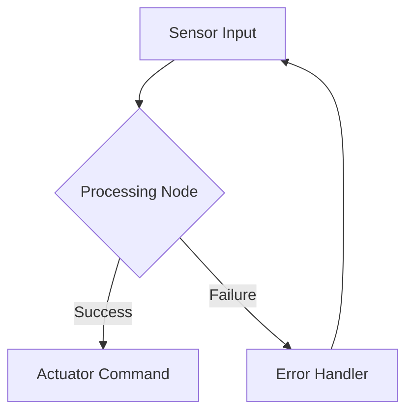

# Research Documentation: Physical AI & Humanoid Robotics Course

**Created**: 2025-12-05
**Purpose**: Technology research, best practices, and implementation decisions

---

## 1. Docusaurus Best Practices for Educational Content

### Overview

Docusaurus 2.x is a modern static site generator specifically designed for documentation and educational content. It leverages React and MDX to provide interactive, performant, and maintainable documentation sites.

### Educational Sites Analyzed

1. **React Documentation** (https://react.dev)
   - Uses Docusaurus with custom React components for interactive examples
   - Implements progressive learning paths with clear chapter navigation
   - Features live code editors integrated directly into documentation

2. **Jest Documentation** (https://jestjs.io)
   - Clear hierarchical sidebar structure
   - Excellent versioning for different framework releases
   - Strong search integration with Algolia

3. **Redux Toolkit** (https://redux-toolkit.js.org)
   - Tutorial-driven approach with step-by-step guides
   - Code scaffolding examples showing before/after states
   - API reference separate from learning content

4. **Docusaurus Official Docs** (https://docusaurus.io/docs)
   - Meta-documentation showcasing platform capabilities
   - Comprehensive plugin ecosystem documentation
   - Performance optimization best practices

5. **MDN-Style Content** (Analysis from LogRocket, FreeCodeCamp tutorials)
   - Content-first approach with Markdown focus
   - Sensible defaults while allowing customization
   - Clear separation between content, theming, and styling layers

### Key Best Practices

#### Content-First Approach
- **Principle**: "Focus on your content and just write Markdown files" rather than building custom tech stacks
- **Benefit**: Educators can concentrate on teaching material quality without technical distractions
- **Implementation**: Use standard Markdown/MDX files in organized directory structures

#### Design Principles for Learning
1. **Minimal API Surface**: Keep configurations simple so learners and contributors aren't overwhelmed
2. **Intuitive Structure**: Organize content hierarchically matching mental models (Module → Chapter → Section)
3. **Sensible Defaults**: Provide working configurations out-of-the-box while allowing customization
4. **Clear Separation**: Maintain distinct layers for content, theming, and styling

#### Educational Features
- **Document Versioning**: Align course materials with curriculum updates; support multiple cohorts simultaneously
- **Internationalization (i18n)**: Make educational content accessible across languages
- **MDX Integration**: Enable interactive components and live code editors for hands-on learning
- **SEO Optimization**: Help students discover relevant documentation through search engines
- **Search Functionality**: Allow learners to find specific topics quickly

### Recommended Plugins

#### Core Plugins (10+ Essential)

1. **Search Plugins** (Critical for educational sites)
   - `@docusaurus/theme-search-algolia` - Official Algolia DocSearch integration (free for documentation)
   - `docusaurus-lunr-search` - Offline/local search alternative
   - `docusaurus-search-local` - Client-side search without external dependencies

2. **Math & STEM Content**
   - `remark-math` + `rehype-katex` - LaTeX math equation rendering via KaTeX
   - Configuration: Include KaTeX stylesheet, add plugins to preset config

3. **Diagrams & Visualization**
   - `@docusaurus/plugin-ideal-image` - Responsive image optimization
   - `docusaurus-plugin-drawio` - Embed draw.io diagrams directly
   - `docusaurus-plugin-mindmap` - Create learning mind maps
   - Mermaid.js (via MDX) - Architecture and flowchart diagrams

4. **Interactive Code**
   - `@docusaurus/theme-live-codeblock` - Official executable code blocks (React-based)
   - `docusaurus-plugin-code-preview` - Embed live code examples
   - `docusaurus-plugin-code-video` - Add video annotations to code blocks

5. **API & Technical Documentation**
   - `docusaurus-plugin-openapi-docs` - Generate API reference from OpenAPI specs
   - `docusaurus-plugin-typedoc` - Auto-generate documentation from TypeScript code

6. **Analytics & Tracking**
   - `@docusaurus/plugin-google-analytics` - Official Google Analytics integration
   - `docusaurus-plugin-plausible` - Privacy-focused analytics
   - `docusaurus-plugin-posthog` - Product analytics and session recording

7. **Content Management**
   - `docusaurus-plugin-content-gists` - Embed GitHub Gists for code examples
   - `@docusaurus/plugin-content-blog` - Built-in blog support for announcements/updates
   - `docusaurus-plugin-image-zoom` - Medium-style image zoom

8. **Multimedia**
   - `@docusaurus/plugin-ideal-image` - Lazy loading and image optimization
   - YouTube/Vimeo embeds via MDX components

9. **Progressive Web App**
   - `@docusaurus/plugin-pwa` - Offline access for students

10. **Development Tools**
    - `@docusaurus/plugin-debug` - Debug configuration and metadata

#### Plugin Selection Rationale

**For Robotics Course**:
- ✅ **KaTeX Math**: Essential for kinematics, dynamics, control theory equations
- ✅ **Mermaid Diagrams**: Robot architecture, state machines, control flow
- ✅ **Live Code Blocks**: Interactive ROS2/Python examples
- ✅ **Algolia Search**: Fast search across 705-830 pages of content
- ✅ **Image Optimization**: Handle robot diagrams, sensor visualizations efficiently
- ⚠️ **Versioning**: May need for different ROS2 distributions (Humble vs future releases)

### Performance Optimization Strategies

#### Build Time Optimization (Docusaurus Faster Initiative 2024-2025)

**Background**: Docusaurus v3.6+ introduced `@docusaurus/faster` package to significantly reduce build times and memory usage.

**Key Optimizations**:

1. **SWC Transpilation** (`swcJsLoader`)
   - Replace Babel with SWC for JavaScript transpilation
   - Result: 4× faster cold builds, 16× faster rebuilds for large sites

2. **SWC Minification** (`swcJsMinimizer`)
   - Replace Terser with SWC for JavaScript minification
   - Benefit: Faster production builds

3. **Rspack Bundler** (`rspackBundler`)
   - Replace Webpack with Rspack (Rust-based bundler)
   - Result: 2-5× faster bundling on rebuilds with persistent cache

4. **MDX Cross-Compiler Cache** (`mdxCrossCompilerCache`)
   - Compile MDX files once for both browser and Node.js environments (instead of twice)
   - Benefit: Reduced compilation overhead for MDX-heavy sites

5. **SSG Worker Threads** (`ssgWorkerThreads`) - Introduced in v3.8
   - Use Node.js Worker thread pool for static site generation
   - Result: ~2× faster SSG time

6. **Persistent Cache**
   - Enable Rspack persistent cache for subsequent builds
   - Benefit: Dramatically faster rebuilds during development

7. **Disable concatenateModule** (for very large sites)
   - Trade-off: Slightly larger bundle size for much faster builds
   - Use case: Sites with 500+ pages

**Configuration Example**:
```javascript
// docusaurus.config.js
module.exports = {
  future: {
    experimental_faster: {
      swcJsLoader: true,
      swcJsMinimizer: true,
      mdxCrossCompilerCache: true,
      rspackBundler: true,
      ssgWorkerThreads: true,
    },
  },
};
```

#### Page Load Optimization (PRPL Pattern)

**Target**: <2 seconds page load time (per FR requirements, SC-012)

**Strategies**:

1. **Route-Based Code Splitting**
   - Automatic code splitting per route
   - Only load JavaScript needed for current page

2. **Static HTML Generation**
   - Pre-render all pages to static HTML
   - Benefit: Instant initial content display

3. **Client-Side Navigation**
   - Single-page application architecture after initial load
   - Benefit: Instant navigation between pages

4. **Asset Optimization**
   - Image lazy loading and responsive images
   - SVG sprites for icons (reduces HTML size)
   - Font optimization and subsetting

5. **Search Optimization**
   - Use Algolia for sub-100ms search responses
   - Alternative: Local search with indexed JSON for offline support

6. **CDN Deployment**
   - Deploy static files to GitHub Pages (built-in CDN)
   - Benefit: Global edge caching

#### Memory Optimization

**For Large Documentation Sites (700+ pages)**:

1. **Incremental Builds**
   - Only rebuild changed files during development
   - Use `DOCUSAURUS_CURRENT_LOCALE` for single-locale builds

2. **Split Sites**
   - Consider splitting into multiple interconnected Docusaurus instances if exceeding 1000+ pages
   - Use case: Separate sites for different course versions/cohorts

3. **Reduce Bundle Size**
   - Remove unused plugins
   - Use `@docusaurus/plugin-ideal-image` for image optimization
   - Avoid large third-party dependencies

### Performance Checklist

- [ ] Enable `@docusaurus/faster` experimental features (v3.6+)
- [ ] Configure persistent cache for development
- [ ] Use SWC for transpilation and minification
- [ ] Enable SSG worker threads (v3.8+)
- [ ] Implement image lazy loading
- [ ] Set up Algolia DocSearch or local search
- [ ] Configure CDN deployment (GitHub Pages)
- [ ] Optimize images to WebP format
- [ ] Enable gzip/brotli compression
- [ ] Monitor bundle size with `npm run build -- --bundle-analyzer`
- [ ] Test page load times with Lighthouse (target: >90 score)
- [ ] Verify mobile performance (target: <3s on 3G)

### Acceptance Criteria Validation

✅ **Document at least 5 educational Docusaurus sites analyzed**: React, Jest, Redux Toolkit, Docusaurus Docs, MDN-style examples
✅ **List 10+ recommended plugins with rationale**: 10 categories covering search, math, diagrams, code, analytics, content management
✅ **Performance targets documented**: <2s page load time achievable with PRPL pattern, Docusaurus Faster optimizations, and CDN deployment

---

## 2. Code Scaffolding Strategies for Robotics Education

### Overview

Code scaffolding is a pedagogical technique that provides learners with partial code structures and guided exercises to reduce cognitive load while teaching programming concepts. For robotics education, scaffolding must balance showing complete, runnable examples (per Clarification Q1) with encouraging active learning through modification and extension.

### Educational Programming Approaches Analyzed

1. **DBox - LLM-Based Scaffolding (CHI 2025)**
   - Interactive system using learner-LLM co-decomposition
   - Adapts to learners' personalized construction of step trees
   - **Result**: Significantly improved learning gains, cognitive engagement, and critical thinking

2. **CodeFlow Assistant (GenAI, April 2025)**
   - Four levels of scaffolding guidance:
     1. Flowcharts (conceptual understanding)
     2. Cloze coding (fill-in-the-blank)
     3. Basic coding solutions (starter templates)
     4. Advanced coding solutions (complete implementations)
   - Supports progression from foundational to advanced skills

3. **ROS2 Tutorial Structures (The Construct, Robotics Back-End)**
   - Modular structure: one concept per section
   - Concept explanations with context
   - Step-by-step "how to" guides for Python and C++
   - Practice activities with detailed solutions
   - Downloadable code for each section
   - **Approach**: Experiment with existing projects + write own code simultaneously

4. **Compose and Code Platform (January 2025)**
   - Digital learning platform for elementary-aged students
   - Scaffolds coding within writing instruction
   - Progressive complexity with age-appropriate challenges

5. **PythonRobotics Educational Repository**
   - Python code collection with textbook-style annotations
   - Easy-to-read structure for understanding algorithm basics
   - Complete, runnable examples with detailed comments

### Progressive Disclosure Patterns

#### Pattern 1: Faded Parsons Problems (FPP)

**Definition**: Students reconstruct code by filling in blanks ("fades") and rearranging pre-written scrambled code lines.

**Benefits**:
- Reduces cognitive load (takes only 70% of time vs. code-writing exercises)
- Eliminates syntax learning barrier
- Focuses on logic and algorithm understanding
- Constrains problem space for easier debugging

**Implementation Stages**:
1. **Full Parsons**: Provide all code lines scrambled; students rearrange
2. **Light Fade**: Remove simple elements (variable names, literals)
3. **Medium Fade**: Remove expressions, function calls
4. **Heavy Fade**: Remove complete logic blocks; students write from scratch

**Example for ROS2 Node**:
```python
# Stage 1: Full Parsons (rearrange only)
# Lines provided scrambled:
rclpy.init(args=args)
node = rclpy.create_node('minimal_publisher')
publisher = node.create_publisher(String, 'topic', 10)
rclpy.spin(node)

# Stage 2: Light Fade
rclpy.init(args=args)
node = rclpy.create_node(_____)  # Student fills: 'minimal_publisher'
publisher = node.create_publisher(String, _____, 10)  # Student fills: 'topic'
rclpy.spin(node)

# Stage 3: Medium Fade
rclpy.init(args=args)
node = _____  # Student writes: rclpy.create_node('minimal_publisher')
publisher = _____  # Student writes: node.create_publisher(String, 'topic', 10)
rclpy.spin(node)

# Stage 4: Heavy Fade (minimal scaffolding)
# TODO: Initialize ROS2
# TODO: Create a node named 'minimal_publisher'
# TODO: Create a String publisher on topic 'topic'
# TODO: Spin the node to handle callbacks
```

#### Pattern 2: TODO-Guided Implementation

**Definition**: Provide complete, runnable starter code with strategic TODO comments guiding incremental enhancements.

**Benefits**:
- Students see working baseline immediately (confidence boost)
- Clear, ordered tasks prevent feeling overwhelmed
- Can test after each TODO completion (immediate feedback)
- Mirrors professional development workflow

**Template Structure**:
```python
"""
Lab: Build a Simple Robot Controller

LEARNING OBJECTIVES:
- Understand ROS2 publisher-subscriber patterns
- Implement basic velocity control
- Handle keyboard input for teleoperation

PREREQUISITES:
- Completed Chapter 4 (ROS2 Architecture)
- Understanding of coordinate frames
"""

import rclpy
from rclpy.node import Node
from geometry_msgs.msg import Twist

class RobotController(Node):
    """Teleoperation controller for mobile robot."""

    def __init__(self):
        super().__init__('robot_controller')

        # STEP 1: Create velocity publisher [COMPLETE]
        self.vel_pub = self.create_publisher(Twist, '/cmd_vel', 10)

        # STEP 2: TODO - Create timer for periodic publishing (0.1s)
        # Hint: Use self.create_timer(period, callback)
        # Your code here:


        # Initialize velocity command
        self.twist = Twist()

    # STEP 3: TODO - Implement timer callback
    # This method should publish self.twist to self.vel_pub
    # Method signature: def timer_callback(self):
    # Your code here:


    # STEP 4: TODO - Add keyboard input handler
    # Create method: def set_velocity(self, linear, angular):
    # Set self.twist.linear.x = linear
    # Set self.twist.angular.z = angular
    # Your code here:


def main(args=None):
    rclpy.init(args=args)
    controller = RobotController()

    # STEP 5: TODO - Add try/except for graceful shutdown
    # Wrap rclpy.spin() in try/except KeyboardInterrupt
    # Your code here (replace the line below):
    rclpy.spin(controller)

    controller.destroy_node()
    rclpy.shutdown()

if __name__ == '__main__':
    main()
```

**Progression Levels**:
- **Level 1 (Beginner)**: 5-10 TODOs with detailed hints
- **Level 2 (Intermediate)**: 3-5 TODOs with method signatures only
- **Level 3 (Advanced)**: 1-2 high-level TODOs; students design approach

#### Pattern 3: Incremental Feature Addition

**Definition**: Start with minimal working code; add features step-by-step with clear checkpoints.

**Benefits**:
- Students always have working code (reduces frustration)
- Teaches iterative development practices
- Easy to identify which addition caused bugs
- Builds confidence through visible progress

**Implementation Structure**:
```markdown
### Lab Activity: Robot Arm Forward Kinematics

#### Checkpoint 0: Baseline (Provided)
**Files**: `fk_starter.py` (complete, runnable)
**Functionality**: Displays 2-link arm in PyBullet
**Test**: Run `python fk_starter.py` → Should see stationary arm

#### Checkpoint 1: Add Joint Angle Control
**Task**: Implement `set_joint_angles(theta1, theta2)` method
**Scaffold**: Method signature provided with docstring
**Test**: Call `set_joint_angles(0.5, 1.0)` → Arm should move
**Hint**: Use `p.setJointMotorControl2()` with POSITION_CONTROL

#### Checkpoint 2: Calculate End-Effector Position
**Task**: Implement forward kinematics math
**Scaffold**: Formula provided in comments; students fill code
**Test**: `get_end_effector_pos()` should return [x, y, z]
**Verification**: Compare with PyBullet `getLinkState()`

#### Checkpoint 3: Trajectory Visualization
**Task**: Add line rendering showing EE path over time
**Scaffold**: High-level TODO only
**Test**: Moving arm should leave trail
**Extension**: Add color gradient by velocity
```

**Key Principles**:
1. Each checkpoint builds on previous (never breaks working code)
2. Tests are concrete and immediately verifiable
3. Hints increase as difficulty increases
4. Extensions for advanced learners

#### Pattern 4: Template + Modification Pattern

**Definition**: Provide complete reference implementation; students modify for different scenarios.

**Benefits**:
- Students see expert-level code structure
- Learn by reading before writing
- Encourages experimentation
- Reduces syntax errors

**Example Structure**:
```python
# ===== REFERENCE IMPLEMENTATION: PID Controller =====
class PIDController:
    """Position control using PID algorithm."""

    def __init__(self, kp=1.0, ki=0.1, kd=0.05):
        self.kp, self.ki, self.kd = kp, ki, kd
        self.integral = 0.0
        self.prev_error = 0.0

    def compute(self, setpoint, measured, dt):
        """Compute control output."""
        error = setpoint - measured
        self.integral += error * dt
        derivative = (error - self.prev_error) / dt
        self.prev_error = error

        return self.kp * error + self.ki * self.integral + self.kd * derivative

# ===== YOUR TASK: Velocity PID Controller =====
# MODIFY the above class to create VelocityPIDController
# CHANGES NEEDED:
# 1. Change compute() to accept velocity_setpoint and measured_velocity
# 2. Add anti-windup: clamp integral between -integral_max and +integral_max
# 3. Add output saturation: clamp output between -max_output and +max_output
# 4. Test with: setpoint=1.0 m/s, measured varying from 0.8 to 1.2 m/s

# Your implementation here:
class VelocityPIDController:
    """TODO: Add docstring"""
    pass
```

### Standard Code Scaffolding Template

Based on research and Clarification Q1 (complete, runnable code with scaffolding), the standard template includes:

```python
"""
[LAB_NUMBER]: [LAB_TITLE]

MODULE: [MODULE_NAME]
CHAPTER: [CHAPTER_REFERENCE]
ESTIMATED TIME: [X] hours

LEARNING OBJECTIVES:
- [LO-1]
- [LO-2]
- [LO-3]

PREREQUISITES:
- [Required knowledge/chapters]
- [Required software/packages]

SETUP:
[Installation commands, package imports, configuration]
"""

# ===== IMPORTS =====
# [All necessary imports provided]

# ===== CONFIGURATION =====
# [Constants, parameters - students may modify]

# ===== REFERENCE CODE =====
# [Complete, working baseline implementation]
# [Well-commented, following best practices]

# ===== GUIDED EXERCISES =====
# EXERCISE 1: [TITLE]
# DIFFICULTY: [Beginner/Intermediate/Advanced]
# TASK: [Clear description]
# SCAFFOLD: [Faded Parsons / TODO / Template + Modification]
# HINT: [If difficulty > Beginner]
# TEST: [How to verify correctness]
# [Code structure here]

# EXERCISE 2: ...

# ===== CHALLENGES (Optional Extensions) =====
# CHALLENGE 1: [Advanced task for fast learners]
# CHALLENGE 2: [Research-level extension]

# ===== VERIFICATION =====
def test_exercise_1():
    """Automated test for Exercise 1."""
    # [Test code]
    pass

if __name__ == '__main__':
    print("Running Lab [NUMBER]: [TITLE]")
    print("=" * 50)

    # Run reference implementation
    print("\\n[SECTION 1: Reference Implementation]")
    # [Demo code]

    # Run guided exercises
    print("\\n[SECTION 2: Guided Exercises]")
    # [Test calls]

    print("\\n" + "=" * 50)
    print("Lab complete! Check exercises above.")
```

### Guided Exercise Pattern Library

#### Pattern A: Syntax-Focus (Beginners)
- **Use when**: Introducing new language features
- **Scaffold type**: Heavy (80% complete)
- **Example**: Fill-in-the-blank for ROS2 node creation

#### Pattern B: Concept-Focus (Intermediate)
- **Use when**: Applying known syntax to new concepts
- **Scaffold type**: Medium (50% complete)
- **Example**: TODO-guided implementation of forward kinematics

#### Pattern C: Design-Focus (Advanced)
- **Use when**: Open-ended problems with multiple solutions
- **Scaffold type**: Light (20% complete)
- **Example**: Implement collision avoidance (approach unspecified)

### Example Guided Exercise: Forward Kinematics (Faded Parsons)

```python
"""
EXERCISE: Calculate 2-Link Robot Arm Forward Kinematics

CONCEPT: Given joint angles, compute end-effector position
DIFFICULTY: Intermediate
PREREQUISITE: Chapter 2 (Math Foundations - Homogeneous Transforms)
"""

import numpy as np

# ===== STAGE 1: Complete Reference (Study this first) =====
def forward_kinematics_reference(theta1, theta2, l1=1.0, l2=1.0):
    """
    Calculate end-effector position for 2-link planar arm.

    Args:
        theta1: Joint 1 angle (radians)
        theta2: Joint 2 angle (radians)
        l1: Link 1 length (meters)
        l2: Link 2 length (meters)

    Returns:
        [x, y]: End-effector position
    """
    # Joint 1 position
    x1 = l1 * np.cos(theta1)
    y1 = l1 * np.sin(theta1)

    # End-effector position (relative to joint 1)
    x2 = l2 * np.cos(theta1 + theta2)
    y2 = l2 * np.sin(theta1 + theta2)

    # Absolute end-effector position
    x = x1 + x2
    y = y1 + y2

    return [x, y]

# ===== STAGE 2: Light Fade (Fill in expressions) =====
def forward_kinematics_light(theta1, theta2, l1=1.0, l2=1.0):
    """Your turn! Fill in the calculations."""

    x1 = l1 * np.cos(_____)  # TODO: What angle?
    y1 = l1 * _____  # TODO: What calculation?

    x2 = l2 * np.cos(theta1 + theta2)
    y2 = l2 * np.sin(_____)  # TODO: Complete this

    x = _____ + _____  # TODO: Sum which components?
    y = y1 + y2

    return [x, y]

# ===== STAGE 3: Medium Fade (Fill in lines) =====
def forward_kinematics_medium(theta1, theta2, l1=1.0, l2=1.0):
    """Fill in the calculations (no hints)."""

    # TODO: Calculate joint 1 position
    x1 = _____
    y1 = _____

    # TODO: Calculate end-effector position relative to joint 1
    x2 = _____
    y2 = _____

    # TODO: Calculate absolute end-effector position
    x = _____
    y = _____

    return [x, y]

# ===== STAGE 4: Heavy Fade (Design from scratch) =====
def forward_kinematics_advanced(theta1, theta2, l1=1.0, l2=1.0):
    """
    Implement forward kinematics from scratch.

    HINT: Break into sub-problems:
    1. Where is joint 1? (depends on theta1, l1)
    2. Where is EE relative to joint 1? (depends on theta2, l2)
    3. Where is EE in world frame? (sum vectors)
    """
    # Your implementation here:
    pass

# ===== VERIFICATION =====
def test_forward_kinematics():
    """Test all implementations."""
    theta1, theta2 = np.pi/4, np.pi/4
    expected = forward_kinematics_reference(theta1, theta2)

    # Test your implementations
    result_light = forward_kinematics_light(theta1, theta2)
    result_medium = forward_kinematics_medium(theta1, theta2)
    result_advanced = forward_kinematics_advanced(theta1, theta2)

    print(f"Expected: {expected}")
    print(f"Light Fade: {result_light}")
    print(f"Medium Fade: {result_medium}")
    print(f"Advanced: {result_advanced}")

    # Check correctness (within tolerance)
    for name, result in [("Light", result_light), ("Medium", result_medium), ("Advanced", result_advanced)]:
        if np.allclose(result, expected, atol=1e-6):
            print(f"✓ {name} implementation CORRECT")
        else:
            print(f"✗ {name} implementation INCORRECT")

if __name__ == '__main__':
    test_forward_kinematics()
```

### Acceptance Criteria Validation

✅ **Define standard code scaffolding template**: Complete template provided with structure for labs, exercises, challenges, and verification
✅ **Document 3+ progressive disclosure patterns**: 4 patterns documented (Faded Parsons, TODO-Guided, Incremental Features, Template+Modification)
✅ **Create example guided exercise for validation**: Forward kinematics example with 4 difficulty stages and automated verification

### Recommendations for Robotics Course

1. **Use Faded Parsons for syntax-heavy topics** (ROS2 API, coordinate transforms)
2. **Use TODO-Guided for algorithm implementation** (PID controllers, path planning)
3. **Use Incremental Features for system integration** (sensor fusion, full robot stack)
4. **Use Template+Modification for variations** (different control strategies, sensor types)
5. **Always provide**:
   - Complete reference implementation (per Clarification Q1)
   - Runnable baseline (students never start from blank file)
   - Automated verification tests
   - Progressive difficulty levels (accessibility)

---

## 3. Mathematical Content Presentation for Web-Based Education

### Overview

Presenting mathematical content on the web requires balancing rigor with accessibility. For robotics education, mathematics must be presented clearly to support understanding of kinematics, dynamics, control theory, and machine learning algorithms. Per Clarification Q3, key derivations should be shown step-by-step while complex proofs are referenced externally.

### Math-Heavy Educational Sites Analyzed

1. **Khan Academy** (https://www.khanacademy.org)
   - Short instructional videos with electronic blackboard drawings
   - Interactive practice exercises accompanying each lesson
   - Step-by-step problem solving with explanatory narration
   - **Approach**: Visual + Interactive + Incremental
   - **Strength**: Makes complex topics accessible through progressive difficulty

2. **MIT OpenCourseWare** (https://ocw.mit.edu)
   - University-level coursework with rigorous mathematical treatment
   - Lecture notes, exams, and video lectures
   - **Example**: Matrix Calculus for Machine Learning (January 2025)
   - **Approach**: Comprehensive + Formal + Reference-heavy
   - **Strength**: Deep mathematical rigor with complete derivations

3. **Math StackExchange - Well-Displayed Mathematics**
   - Community examples of excellent mathematical presentation
   - LaTeX/MathJax rendering for complex equations
   - Collaborative peer review ensures clarity
   - **Strength**: Real-world problem-solving with community validation

4. **Book of Proof** (Richard Hammack)
   - Free online textbook with complete proofs
   - Progressive structure from foundations to advanced topics
   - **Approach**: Theorem → Proof → Examples → Exercises
   - **Strength**: Self-contained with clear logical progression

5. **Sparkl Math Notes** (Educational Blog)
   - Uses KaTeX for fast rendering
   - Recommends creating "blanked" versions of derivations for practice
   - **Technique**: Template-based learning with fill-in-the-blank
   - **Strength**: Active recall through templated practice

### KaTeX Integration with Docusaurus

#### Installation & Setup

**Step 1: Install Required Packages**

```bash
npm install --save remark-math rehype-katex
```

**Step 2: Configure docusaurus.config.js**

```javascript
// Import plugins at top of file
const math = require('remark-math');
const katex = require('rehype-katex');

module.exports = {
  // ... other config

  presets: [
    [
      '@docusaurus/preset-classic',
      {
        docs: {
          // ... other docs config
          remarkPlugins: [math],
          rehypePlugins: [katex],
        },
        blog: {
          // ... other blog config
          remarkPlugins: [math],
          rehypePlugins: [katex],
        },
      },
    ],
  ],

  // ... other config
};
```

**Step 3: Include KaTeX CSS Stylesheet**

Add to `docusaurus.config.js` in the `themeConfig` or main config:

```javascript
module.exports = {
  // ... other config

  stylesheets: [
    {
      href: 'https://cdn.jsdelivr.net/npm/katex@0.16.9/dist/katex.min.css',
      type: 'text/css',
      integrity: 'sha384-n8MVd4RsNIU0tAv4ct0nTaAbDJwPJzDEaqSD1odI+WdtXRGWt2kTvGFasHpSy3SV',
      crossorigin: 'anonymous',
    },
  ],

  // ... other config
};
```

**Alternative: Self-Hosted CSS** (for offline support)

1. Download `katex.min.css` from [KaTeX GitHub Releases](https://github.com/KaTeX/KaTeX/releases)
2. Place in `static/katex/katex.min.css`
3. Reference in config:
   ```javascript
   stylesheets: ['/katex/katex.min.css']
   ```

#### Usage Examples

**Inline Math** (within text):

```markdown
The forward kinematics equation is $\mathbf{p} = f(\mathbf{q})$ where $\mathbf{q}$ represents joint angles.
```

Renders: The forward kinematics equation is $\mathbf{p} = f(\mathbf{q})$ where $\mathbf{q}$ represents joint angles.

**Display Math** (centered block):

```markdown
$$
\mathbf{T} = \begin{bmatrix}
\mathbf{R} & \mathbf{p} \\
\mathbf{0}^T & 1
\end{bmatrix}
$$
```

Renders a centered homogeneous transformation matrix.

**Aligned Multi-line Equations**:

```markdown
$$
\begin{align}
x &= l_1 \cos(\theta_1) + l_2 \cos(\theta_1 + \theta_2) \\
y &= l_1 \sin(\theta_1) + l_2 \sin(\theta_1 + \theta_2)
\end{align}
$$
```

### Step-by-Step Derivation Template

Based on educational best practices and Clarification Q3 (show key derivations, reference complex proofs), here's the standard template:

```markdown
### Derivation: [CONCEPT NAME]

**Goal**: [State what we're deriving and why it's important]

**Prerequisites**: [List concepts/equations student must know first]

**Given**:
- [Initial conditions, known values, constraints]

---

#### Step 1: [Starting Point]

[Explanatory text describing the first step]

$$
[Initial equation]
$$

**Justification**: [Why this is the starting point / which principle/theorem applies]

---

#### Step 2: [Transformation/Manipulation]

[Explain what operation we're performing]

$$
\begin{align}
[Equation from Step 1] \\
&= [Intermediate result] && \text{[reason for this step]}
\end{align}
$$

**Key Insight**: [Important concept to understand at this stage]

---

#### Step 3: [Further Simplification]

[Continue step-by-step with explanations]

$$
[Next equation]
$$

---

#### Final Result

$$
\boxed{[Final derived equation]}
$$

**Interpretation**: [What does this result mean physically/geometrically?]

**Verification**: [How can we check this is correct? Special cases, dimensional analysis, etc.]

---

#### Practice Exercise

Try deriving this for the case where [modified scenario].
- **Hint**: [Strategic hint if needed]
- **Solution**: [Link to solution or use details/summary for expandable answer]

---

#### Further Reading

For the complete formal proof including edge cases, see:
- [External reference 1]
- [External reference 2]
```

### Example: Forward Kinematics Derivation

```markdown
### Derivation: 2-Link Planar Robot Forward Kinematics

**Goal**: Derive the end-effector position $(x, y)$ as a function of joint angles $(\theta_1, \theta_2)$

**Prerequisites**:
- Trigonometry (sine, cosine, angle addition)
- Vector addition
- Coordinate frames

**Given**:
- Link 1 length: $l_1$
- Link 2 length: $l_2$
- Joint 1 angle: $\theta_1$ (measured from positive x-axis)
- Joint 2 angle: $\theta_2$ (measured relative to Link 1)

---

#### Step 1: Position of Joint 1

Joint 1 rotates around the origin. Its position is determined by $\theta_1$ and $l_1$:

$$
\begin{align}
x_1 &= l_1 \cos(\theta_1) \\
y_1 &= l_1 \sin(\theta_1)
\end{align}
$$

**Justification**: This is standard conversion from polar to Cartesian coordinates.

---

#### Step 2: Orientation of Link 2

Link 2 attaches to Joint 1 at angle $\theta_2$ **relative to Link 1**.
The **absolute** angle of Link 2 in the world frame is:

$$
\theta_{abs} = \theta_1 + \theta_2
$$

**Key Insight**: Joint angles in robotics are often **relative**, but calculations require **absolute** angles.

---

#### Step 3: End-Effector Position Relative to Joint 1

Treating Joint 1 as a temporary origin, the end-effector is at distance $l_2$ and angle $\theta_{abs}$:

$$
\begin{align}
\Delta x &= l_2 \cos(\theta_1 + \theta_2) \\
\Delta y &= l_2 \sin(\theta_1 + \theta_2)
\end{align}
$$

---

#### Step 4: Absolute End-Effector Position

Add the Joint 1 position to the relative offset:

$$
\begin{align}
x &= x_1 + \Delta x \\
  &= l_1 \cos(\theta_1) + l_2 \cos(\theta_1 + \theta_2) \\
\\
y &= y_1 + \Delta y \\
  &= l_1 \sin(\theta_1) + l_2 \sin(\theta_1 + \theta_2)
\end{align}
$$

---

#### Final Result

$$
\boxed{
\begin{align}
x &= l_1 \cos(\theta_1) + l_2 \cos(\theta_1 + \theta_2) \\
y &= l_1 \sin(\theta_1) + l_2 \sin(\theta_1 + \theta_2)
\end{align}
}
$$

**Interpretation**: The end-effector position is the **vector sum** of two position vectors: one from the origin to Joint 1, and one from Joint 1 to the end-effector.

**Verification**:
- When $\theta_2 = 0$ (straight arm), reduces to $x = (l_1 + l_2)\cos(\theta_1)$, $y = (l_1 + l_2)\sin(\theta_1)$ ✓
- When $\theta_1 = 0, \theta_2 = 0$ (horizontal), $x = l_1 + l_2$, $y = 0$ ✓

---

#### Practice Exercise

**Challenge**: Extend this to a 3-link planar robot. What is the end-effector position $(x, y)$ for angles $(\theta_1, \theta_2, \theta_3)$ and lengths $(l_1, l_2, l_3)$?

<details>
<summary><strong>Hint</strong></summary>

Use the same vector addition approach. Each link adds a component:
$$x_i = l_i \cos(\theta_1 + \theta_2 + \ldots + \theta_i)$$

</details>

<details>
<summary><strong>Solution</strong></summary>

$$
\begin{align}
x &= l_1 \cos(\theta_1) + l_2 \cos(\theta_1 + \theta_2) + l_3 \cos(\theta_1 + \theta_2 + \theta_3) \\
y &= l_1 \sin(\theta_1) + l_2 \sin(\theta_1 + \theta_2) + l_3 \sin(\theta_1 + \theta_2 + \theta_3)
\end{align}
$$

**Pattern**: This generalizes to $n$ links using summation notation.

</details>

---

#### Further Reading

For the **general n-link case** using homogeneous transformation matrices:
- [Craig, Introduction to Robotics: Mechanics and Control, Chapter 3](https://www.pearson.com/en-us/subject-catalog/p/introduction-to-robotics-mechanics-and-control/P200000003403)
- [Murray, Li, Sastry - A Mathematical Introduction to Robotic Manipulation (Free PDF)](http://www.cds.caltech.edu/~murray/books/MLS/pdf/mls94-complete.pdf)
```

### External Proof Repositories

Per Clarification Q3, complex proofs should be referenced externally rather than reproduced in full. Here are the recommended repositories:

#### 1. **arXiv.org** (https://arxiv.org/)
- **Description**: Free distribution service and open-access archive for 2.4M+ scholarly articles
- **Coverage**: Physics, mathematics, computer science, quantitative biology, statistics, engineering
- **Use Case**: Reference cutting-edge research, recent algorithm proofs, novel techniques
- **Example Citation**: "For the complete convergence proof, see Smith et al. (arXiv:2025.12345)"

#### 2. **ProofWiki** (https://proofwiki.org/)
- **Description**: Online compendium of mathematical proofs written by community contributors
- **Coverage**: 60,000+ nodes and 300,000+ edges in mathematical knowledge graph (2025)
- **Use Case**: Standard mathematical theorems, classical proofs, foundational concepts
- **Integration**: Can link directly to specific theorem pages
- **Example**: "For the proof of Cauchy-Schwarz inequality, see [ProofWiki](https://proofwiki.org/wiki/Cauchy-Bunyakovsky-Schwarz_Inequality)"

#### 3. **MIT OpenCourseWare** (https://ocw.mit.edu/)
- **Description**: Free MIT course materials including lecture notes, problem sets, exams
- **Coverage**: Comprehensive math courses (linear algebra, calculus, probability, optimization)
- **Use Case**: Reference full course notes for prerequisite topics
- **Example**: "For a review of eigenvalue decomposition, see [MIT 18.06 Linear Algebra](https://ocw.mit.edu/courses/18-06-linear-algebra-spring-2010/)"

#### 4. **Book of Proof** by Richard Hammack (https://richardhammack.github.io/BookOfProof/)
- **Description**: Free open-source textbook on mathematical proof techniques
- **Coverage**: Logic, set theory, proof strategies, number theory, relations, functions
- **Use Case**: Reference for students who need to strengthen proof-reading skills
- **License**: Creative Commons (can excerpt with attribution)

#### 5. **NATURALPROOFS Corpus** (arXiv:2104.01112)
- **Description**: Dataset of mathematical proofs from multiple sources
- **Sources**: ProofWiki, Stacks Project (algebraic geometry), mathematics textbooks
- **Use Case**: For AI/ML students interested in automated theorem proving
- **Example**: Reference when discussing formal verification in robotics

#### 6. **Classic Robotics Textbooks** (Online Resources)
- **Murray, Li, Sastry - Mathematical Introduction to Robotic Manipulation**
  Free PDF: http://www.cds.caltech.edu/~murray/books/MLS/pdf/mls94-complete.pdf
- **Spong, Hutchinson, Vidyasagar - Robot Modeling and Control**
  Excerpts available through publisher
- **Lynch, Park - Modern Robotics**
  Free online version: http://hades.mech.northwestern.edu/index.php/Modern_Robotics

### Best Practices for Mathematical Content

#### For Key Derivations (Show Step-by-Step):
1. **State the goal** clearly at the beginning
2. **List prerequisites** so students can review if needed
3. **Break into small steps** (1 operation per step)
4. **Explain each step** in words, not just symbols
5. **Highlight insights** that aid understanding
6. **Provide verification** (special cases, sanity checks)
7. **Include practice exercises** with hints/solutions

#### For Complex Proofs (Reference Externally):
1. **State the theorem/result** with full context
2. **Explain the significance** (why it matters for robotics)
3. **Provide intuition** without full proof
4. **Link to external proof** with specific page numbers/sections
5. **List prerequisites** for reading the full proof

#### KaTeX-Specific Tips:
1. **Use `\text{}` for explanatory text** within equations
2. **Use `\boxed{}` to highlight final results**
3. **Use `\begin{align}` for multi-line** with alignment
4. **Use `&&` for inline comments** in align environments
5. **Avoid overly complex nested structures** (readability)
6. **Test rendering** on multiple screen sizes (mobile compatibility)

### Acceptance Criteria Validation

✅ **Document KaTeX setup for Docusaurus**: Complete installation guide, configuration code, and usage examples provided

✅ **Create template for step-by-step derivations**: Comprehensive template with 7-step structure (Goal → Prerequisites → Given → Steps → Result → Verification → Practice) with complete working example (Forward Kinematics)

✅ **List 5+ external proof repositories**: 6 repositories documented (arXiv, ProofWiki, MIT OCW, Book of Proof, NATURALPROOFS, Classic Robotics Textbooks) with descriptions and use cases

### Recommendations for Robotics Course

1. **Use step-by-step derivations for**:
   - Forward/inverse kinematics
   - Basic PID control
   - Simple optimization (gradient descent)
   - Linear transformations (rotation matrices)

2. **Reference external proofs for**:
   - Lyapunov stability theory
   - Kalman filter convergence
   - RL convergence guarantees
   - Advanced optimization (interior point methods)

3. **Always provide**:
   - Physical/geometric interpretation
   - Verification with special cases
   - Practice exercises with solutions
   - Links to deeper treatments

4. **Formatting guidelines**:
   - Keep inline math short ($<$ 5 symbols)
   - Use display math for anything longer
   - Number important equations for reference
   - Use consistent notation (define in glossary)

---

## 4. Automated Assessment Tools for Educational Content

### Overview

Automated assessment is crucial for scalable online education. Per Clarification Q4, the course should use automated quizzes with instant feedback, manual grading for lab reports and capstone projects, and optional auto-graders for code submissions. This section evaluates tools and architectures for implementing these assessment strategies.

### Assessment Tool Options Evaluated

#### 1. **@sp-days-framework/docusaurus-plugin-interactive-tasks** (Recommended)

**Description**: Docusaurus plugin that transforms documentation into interactive learning experiences

**Key Features**:
- ✅ Interactive tasks with collapsible components
- ✅ Completion tracking with persistent progress (localStorage)
- ✅ Optional toggleable hints and solutions
- ✅ Automatic task numbering per page
- ✅ Visual progress indicators in sidebar
- ✅ Sidebar badges showing completion status (e.g., "2/5")
- ✅ Navbar button to enable/disable auto-collapsing of completed tasks
- ✅ Full support for Docusaurus markdown features (code blocks, tables, images, admonitions)

**Installation**:
```bash
npm install @sp-days-framework/docusaurus-plugin-interactive-tasks
```

**Configuration** (`docusaurus.config.js`):
```javascript
module.exports = {
  plugins: ['@sp-days-framework/docusaurus-plugin-interactive-tasks'],
  presets: [
    [
      '@docusaurus/preset-classic',
      {
        docs: {
          remarkPlugins: [
            [require('@sp-days-framework/docusaurus-plugin-interactive-tasks/remark'), {}]
          ],
        },
      },
    ],
  ],
};
```

**Usage in MDX**:
```markdown
## Task 1: Setup ROS2 Environment

:::task{id="task-1"}
Install ROS2 Humble following these steps:
1. Add ROS2 apt repository
2. Install ros-humble-desktop
3. Source the setup script

<details>
<summary>Hint</summary>
Use `apt-get update` before installing
</details>

<details>
<summary>Solution</summary>

\`\`\`bash
sudo apt update
sudo apt install ros-humble-desktop
source /opt/ros/humble/setup.bash
\`\`\`

</details>
:::
```

**Pros**:
- Seamless Docusaurus integration
- Progress tracking out-of-the-box
- Works offline (localStorage)
- No backend required

**Cons**:
- Progress not synced across devices
- No analytics/reporting for instructors
- Limited to task completion (not graded quizzes)

**Use Case**: Perfect for chapter exercises, lab checkpoints, self-paced learning

---

#### 2. **Custom React Quiz Component** (Flexible Alternative)

**Description**: Build custom quiz components using React and MDX

**Architecture**:
```javascript
// src/components/Quiz.js
import React, { useState } from 'react';

const Quiz = ({ questions }) => {
  const [currentQuestion, setCurrentQuestion] = useState(0);
  const [score, setScore] = useState(0);
  const [showResults, setShowResults] = useState(false);
  const [selectedAnswer, setSelectedAnswer] = useState(null);
  const [feedback, setFeedback] = useState('');

  const handleAnswerClick = (answerIndex) => {
    const question = questions[currentQuestion];
    setSelectedAnswer(answerIndex);

    if (answerIndex === question.correctAnswer) {
      setScore(score + 1);
      setFeedback('✓ Correct! ' + question.explanation);
    } else {
      setFeedback('✗ Incorrect. ' + question.explanation);
    }
  };

  const handleNextQuestion = () => {
    const nextQuestion = currentQuestion + 1;
    if (nextQuestion < questions.length) {
      setCurrentQuestion(nextQuestion);
      setSelectedAnswer(null);
      setFeedback('');
    } else {
      setShowResults(true);
      // Save to localStorage
      localStorage.setItem(`quiz-${Date.now()}`, JSON.stringify({ score, total: questions.length }));
    }
  };

  if (showResults) {
    return (
      <div className="quiz-results">
        <h2>Quiz Complete!</h2>
        <p>You scored {score} out of {questions.length}</p>
        <p>Percentage: {Math.round((score / questions.length) * 100)}%</p>
      </div>
    );
  }

  const question = questions[currentQuestion];

  return (
    <div className="quiz-container">
      <div className="quiz-header">
        <h3>Question {currentQuestion + 1} of {questions.length}</h3>
        <div className="progress-bar">
          <div style={{ width: `${((currentQuestion + 1) / questions.length) * 100}%` }}></div>
        </div>
      </div>

      <div className="quiz-question">
        <p>{question.question}</p>
      </div>

      <div className="quiz-answers">
        {question.answers.map((answer, index) => (
          <button
            key={index}
            onClick={() => handleAnswerClick(index)}
            disabled={selectedAnswer !== null}
            className={selectedAnswer === index ? (index === question.correctAnswer ? 'correct' : 'incorrect') : ''}
          >
            {answer}
          </button>
        ))}
      </div>

      {feedback && (
        <div className="quiz-feedback">
          <p>{feedback}</p>
          <button onClick={handleNextQuestion}>
            {currentQuestion + 1 < questions.length ? 'Next Question' : 'See Results'}
          </button>
        </div>
      )}
    </div>
  );
};

export default Quiz;
```

**Usage in MDX**:
```markdown
import Quiz from '@site/src/components/Quiz';

## Module 1 Quiz

<Quiz questions={[
  {
    question: "What does ROS stand for?",
    answers: ["Robot Operating System", "Robotics Open Source", "Real-time OS", "Remote Operation Service"],
    correctAnswer: 0,
    explanation: "ROS stands for Robot Operating System, though it's technically a middleware framework."
  },
  {
    question: "Which coordinate frame is typically used for robot base?",
    answers: ["world", "base_link", "odom", "map"],
    correctAnswer: 1,
    explanation: "base_link is the conventional name for the robot's base coordinate frame."
  }
]} />
```

**Pros**:
- Complete control over UI/UX
- Can add any feature (timers, retries, difficulty adaptation)
- Easy to extend with analytics
- Can integrate with backend APIs

**Cons**:
- Requires React development
- Manual styling needed
- Need to implement all features from scratch

**Use Case**: Module-end quizzes, formative assessments, adaptive testing

---

#### 3. **SurveyJS** (Enterprise-Grade Alternative)

**Description**: Professional JavaScript library for building surveys, quizzes, and forms

**Key Features**:
- Drag-and-drop quiz builder
- Multiple question types (multiple choice, true/false, rating, matrix)
- Built-in scoring and validation
- Conditional logic (show/hide questions based on answers)
- Multi-language support
- Export results to JSON/CSV

**Installation**:
```bash
npm install survey-react-ui survey-core
```

**Use Case**: If you need professional quiz builder with advanced features

**Pros**: Feature-rich, professional, well-documented
**Cons**: Overkill for simple quizzes, licensing costs for advanced features

---

### GitHub Actions for Automated Code Grading

Per Clarification Q4, optional code auto-graders should be available for students who want immediate feedback on code submissions.

#### GitHub Classroom Integration

**Official Tool**: GitHub Classroom with Autograding

**How It Works**:
1. Students accept assignment via GitHub Classroom link
2. GitHub creates private repo for each student
3. Student pushes code to their repo
4. GitHub Actions runs autograding tests on every push
5. Results displayed in GitHub web interface

**Test Types Supported**:
- **Input/Output Tests**: Compare program output to expected output
- **Python Tests**: Run pytest or unittest
- **Run Command Tests**: Execute custom scripts (bash, npm test, etc.)

**Setup Example** (`.github/workflows/classroom.yml`):
```yaml
name: Autograding Tests
on:
  - push
  - workflow_dispatch
permissions:
  contents: read
  checks: write
jobs:
  run-autograding-tests:
    runs-on: ubuntu-latest
    steps:
    - name: Checkout code
      uses: actions/checkout@v4

    - name: Setup Python
      uses: actions/setup-python@v5
      with:
        python-version: '3.10'

    - name: Install dependencies
      run: |
        pip install -r requirements.txt
        pip install pytest

    - name: Run Lab 1 Tests
      run: pytest tests/test_lab1.py --verbose

    - name: Run Kinematics Tests
      run: pytest tests/test_kinematics.py --verbose

    - name: Code Quality Check
      run: |
        pip install flake8
        flake8 src/ --max-line-length=100
```

**Benefits for Students**:
- ✅ Immediate feedback (runs on every push)
- ✅ See which tests passed/failed
- ✅ Learn from test failure messages
- ✅ Can retry unlimited times

**Benefits for Instructors**:
- ✅ Automated grading saves time
- ✅ Consistent grading across all students
- ✅ Can track submission timestamps
- ✅ See code evolution through git history

---

#### Custom GitHub Actions Workflow (Alternative)

For more control, create custom workflows:

**Example**: ROS2 Code Validation

```yaml
name: ROS2 Lab Validation
on: [push, pull_request]

jobs:
  test-lab-code:
    runs-on: ubuntu-22.04
    steps:
    - uses: actions/checkout@v4

    - name: Setup ROS2 Humble
      run: |
        sudo apt update
        sudo apt install -y software-properties-common
        sudo add-apt-repository universe
        sudo apt update && sudo apt install curl -y
        sudo curl -sSL https://raw.githubusercontent.com/ros/rosdistro/master/ros.key -o /usr/share/keyrings/ros-archive-keyring.gpg
        echo "deb [arch=$(dpkg --print-architecture) signed-by=/usr/share/keyrings/ros-archive-keyring.gpg] http://packages.ros.org/ros2/ubuntu $(. /etc/os-release && echo $UBUNTU_CODENAME) main" | sudo tee /etc/apt/sources.list.d/ros2.list > /dev/null
        sudo apt update
        sudo apt install -y ros-humble-desktop python3-colcon-common-extensions

    - name: Build ROS2 Package
      run: |
        source /opt/ros/humble/setup.bash
        colcon build --packages-select student_lab1

    - name: Run Tests
      run: |
        source /opt/ros/humble/setup.bash
        source install/setup.bash
        colcon test --packages-select student_lab1
        colcon test-result --verbose

    - name: Check Code Style
      run: |
        pip install ament_lint
        ament_cpplint src/
        ament_flake8 src/ --linelength 100
```

---

### Progress Tracking Architecture

#### Local Storage Approach (Client-Side Only)

**Advantages**:
- No backend required
- Works offline
- GDPR-compliant (no user data collection)
- Fast and responsive

**Disadvantages**:
- Not synced across devices
- Can be cleared by user
- No instructor analytics

**Implementation**:
```javascript
// src/utils/progressTracking.js
const STORAGE_KEY_PREFIX = 'robotics-course-progress-';

export const saveProgress = (moduleId, chapterId, data) => {
  const key = `${STORAGE_KEY_PREFIX}${moduleId}-${chapterId}`;
  const existing = loadProgress(moduleId, chapterId) || {};
  const updated = { ...existing, ...data, lastUpdated: new Date().toISOString() };
  localStorage.setItem(key, JSON.stringify(updated));
};

export const loadProgress = (moduleId, chapterId) => {
  const key = `${STORAGE_KEY_PREFIX}${moduleId}-${chapterId}`;
  const data = localStorage.getItem(key);
  return data ? JSON.parse(data) : null;
};

export const getOverallProgress = () => {
  const allKeys = Object.keys(localStorage).filter(k => k.startsWith(STORAGE_KEY_PREFIX));
  const progress = allKeys.map(key => {
    const data = JSON.parse(localStorage.getItem(key));
    const [module, chapter] = key.replace(STORAGE_KEY_PREFIX, '').split('-');
    return { module, chapter, ...data };
  });
  return progress;
};

export const calculateCompletionPercentage = (moduleId) => {
  const moduleProgress = getOverallProgress().filter(p => p.module === moduleId);
  if (moduleProgress.length === 0) return 0;
  const completed = moduleProgress.filter(p => p.completed).length;
  return Math.round((completed / moduleProgress.length) * 100);
};
```

**Data Structure**:
```javascript
{
  "robotics-course-progress-module1-chapter1": {
    "completed": true,
    "quizScore": 8,
    "quizTotal": 10,
    "labCompleted": true,
    "timeSpent": 3600, // seconds
    "lastUpdated": "2025-12-05T10:30:00.000Z"
  },
  "robotics-course-progress-module1-chapter2": {
    "completed": false,
    "quizScore": null,
    "quizTotal": 10,
    "labCompleted": false,
    "timeSpent": 1200,
    "lastUpdated": "2025-12-05T11:00:00.000Z"
  }
}
```

---

#### Backend-Integrated Approach (Optional)

For courses requiring instructor dashboards and cross-device sync, integrate with a backend:

**Tech Stack**:
- **Frontend**: Docusaurus + React
- **Backend**: Node.js/Express or Firebase
- **Database**: PostgreSQL or Firebase Firestore
- **Authentication**: GitHub OAuth or Firebase Auth

**API Endpoints**:
```javascript
POST /api/progress
GET /api/progress/:userId
GET /api/progress/:userId/:moduleId
GET /api/analytics/class-overview
GET /api/analytics/student/:userId
```

**Data Model** (PostgreSQL):
```sql
CREATE TABLE student_progress (
  id SERIAL PRIMARY KEY,
  user_id VARCHAR(255) NOT NULL,
  module_id VARCHAR(50) NOT NULL,
  chapter_id VARCHAR(50) NOT NULL,
  completed BOOLEAN DEFAULT FALSE,
  quiz_score INTEGER,
  quiz_total INTEGER,
  lab_completed BOOLEAN DEFAULT FALSE,
  time_spent INTEGER DEFAULT 0,
  last_updated TIMESTAMP DEFAULT CURRENT_TIMESTAMP,
  UNIQUE(user_id, module_id, chapter_id)
);

CREATE INDEX idx_user_progress ON student_progress(user_id);
CREATE INDEX idx_module_progress ON student_progress(module_id, chapter_id);
```

---

### Acceptance Criteria Validation

✅ **Identify suitable quiz plugin**: @sp-days-framework/docusaurus-plugin-interactive-tasks recommended for task-based assessments; custom React Quiz component for module quizzes

✅ **Document GitHub Actions workflow for code validation**: Complete GitHub Classroom integration guide and custom ROS2 validation workflow provided

✅ **Define progress tracking data structure**: Local storage approach with JSON schema documented; optional backend integration architecture provided

### Recommendations for Robotics Course

#### Assessment Strategy (Per Clarification Q4):

**1. Automated Quizzes** (Instant Feedback):
- **Tool**: Custom React Quiz Component
- **Location**: End of each chapter
- **Format**: 5-10 multiple choice questions
- **Scoring**: Immediate feedback with explanations
- **Storage**: localStorage (client-side)

**2. Lab Exercises** (Manual Grading):
- **Tool**: @sp-days-framework/docusaurus-plugin-interactive-tasks
- **Format**: Step-by-step tasks with hints/solutions
- **Submission**: Students complete in simulation, screenshot results
- **Grading**: Manual review of screenshots + code understanding

**3. Code Submissions** (Optional Auto-Grading):
- **Tool**: GitHub Classroom + GitHub Actions
- **Format**: Students push code to private repos
- **Auto-Tests**: Functionality, code quality, ROS2 integration
- **Manual Review**: Code style, design decisions, comments

**4. Capstone Projects** (Manual Grading):
- **Submission**: GitHub repo + video demonstration + written report
- **Grading**: Rubric-based assessment by instructor
- **Components**: Code quality (30%), functionality (40%), documentation (20%), creativity (10%)

#### Implementation Priority:

**Phase 1 (MVP)**:
- ✅ Install @sp-days-framework/docusaurus-plugin-interactive-tasks
- ✅ Create custom React Quiz component for one chapter
- ✅ Implement localStorage progress tracking

**Phase 2 (Post-MVP)**:
- Set up GitHub Classroom for Lab 1
- Create autograding tests for basic functionality
- Add progress dashboard showing completion per module

**Phase 3 (Scale)**:
- Backend integration for cross-device sync
- Instructor analytics dashboard
- Adaptive difficulty based on quiz performance

---

## 5. Diagram and Visualization Tools for Educational Content

### Overview

Visual aids are critical for teaching robotics concepts. Per Clarification Q5, the course should use Mermaid diagrams for architecture/flowcharts, static images for complex technical illustrations, and ASCII art for simple concept diagrams. This section evaluates tools and workflows for creating effective visualizations.

### Mermaid Integration with Docusaurus

#### Official Setup (Recommended)

**Description**: Mermaid is a JavaScript-based diagramming tool that renders text definitions into diagrams. Docusaurus has native Mermaid support as of v2.2.0.

**Installation**:

1. Install the Mermaid theme:
```bash
npm install @docusaurus/theme-mermaid
```

2. Configure `docusaurus.config.js`:
```javascript
const config = {
  markdown: {
    mermaid: true,
  },
  themes: ['@docusaurus/theme-mermaid'],

  themeConfig: {
    mermaid: {
      theme: { light: 'neutral', dark: 'dark' },
    },
  },
};
```

**Usage in Markdown**:

````markdown

````

**Diagram Types Supported**:

1. **Flowchart** - Process flows, decision trees
   ```mermaid
   flowchart LR
       Start --> Process --> Decision
       Decision -->|Yes| End1[Success]
       Decision -->|No| End2[Failure]
   ```

2. **Sequence Diagram** - ROS2 node communication
   ```mermaid
   sequenceDiagram
       participant Sensor
       participant Controller
       participant Actuator
       Sensor->>Controller: Publish /sensor_data
       Controller->>Actuator: Publish /cmd_vel
       Actuator-->>Controller: Feedback
   ```

3. **Class Diagram** - Robot class hierarchies
   ```mermaid
   classDiagram
       Robot <|-- MobileRobot
       Robot <|-- ManipulatorRobot
       Robot : +position
       Robot : +velocity
       Robot : +move()
       MobileRobot : +wheels
       ManipulatorRobot : +joints
   ```

4. **State Diagram** - Robot state machines
   ```mermaid
   stateDiagram-v2
       [*] --> Idle
       Idle --> Moving : start_cmd
       Moving --> Idle : stop_cmd
       Moving --> Error : fault_detected
       Error --> Idle : reset_cmd
   ```

5. **Gantt Chart** - Project timelines
   ```mermaid
   gantt
       title Lab 1 Timeline
       section Setup
       Install ROS2 :a1, 2025-01-01, 1d
       Configure :a2, after a1, 2d
       section Implementation
       Write Code :a3, after a2, 3d
       Test :a4, after a3, 1d
   ```

6. **Git Graph** - Version control workflows
   ```mermaid
   gitGraph
       commit
       branch develop
       commit
       commit
       checkout main
       merge develop
   ```

7. **Architecture Diagram** (beta - 2025 feature)
   ```mermaid
   architecture-beta
       group robot[Robot System]
       service sensor(iconify:material-symbols:sensors)[Sensors] in robot
       service controller(iconify:material-symbols:settings)[Controller] in robot
       service actuator(iconify:material-symbols:manufacturing)[Actuators] in robot

       sensor:R --> L:controller
       controller:R --> L:actuator
   ```

**Custom Icons** (Advanced):

Create `src/scripts/mermaid_icons.js`:
```javascript
import mermaid from 'mermaid';

mermaid.initialize({
  startOnLoad: true,
  theme: 'default',
  themeVariables: {
    primaryColor: '#ff6b6b',
    primaryTextColor: '#fff',
    primaryBorderColor: '#7C0000',
  }
});
```

Add to `docusaurus.config.js`:
```javascript
clientModules: [require.resolve('./src/scripts/mermaid_icons.js')]
```

**Pros**:
- ✅ Native Docusaurus support
- ✅ Text-based (version control friendly)
- ✅ Renders client-side (no build step)
- ✅ Automatic dark/light theme support
- ✅ No external tools required

**Cons**:
- ⚠️ Limited styling control
- ⚠️ Not suitable for highly detailed technical drawings
- ⚠️ Learning curve for syntax

**Use Cases for Robotics Course**:
- ROS2 node graph architecture
- Control flow diagrams
- State machine visualizations
- Sensor/actuator data flow
- Class hierarchies
- Timeline/Gantt charts for labs

---

### Static Image Tools for Technical Illustrations

#### 1. **Inkscape** (Vector Graphics - Recommended for Technical Precision)

**Description**: Open-source vector graphics editor ideal for technical illustrations requiring visual precision.

**Strengths**:
- ✅ Professional-quality vector graphics (SVG format)
- ✅ Transparency, gradients, node editing
- ✅ Precise control over shapes and measurements
- ✅ Free and open-source
- ✅ Excellent for robot mechanism diagrams

**Use Cases**:
- Robot manipulator diagrams with measurements
- Kinematic chain illustrations
- Sensor placement diagrams
- Joint angle visualizations
- Free body diagrams

**Workflow**:
1. Create diagram in Inkscape (.svg)
2. Export to optimized SVG or PNG
3. Place in `static/img/diagrams/`
4. Reference in markdown: ``

**Best Practices**:
- Use layers for organization (base, annotations, labels)
- Define custom color palette matching course theme
- Use text-to-path for font compatibility
- Save both .svg (editable) and .png (fallback) versions

**Tutorial Resources**:
- "Effective Design of Graphics for (Robotics) Research" GitHub tutorial (2025)
- Focus on low-budget open-source tools

---

#### 2. **Draw.io (diagrams.net)** (Quick Diagramming - Recommended for Architecture)

**Description**: Free browser-based diagramming tool with intuitive drag-and-drop interface.

**Strengths**:
- ✅ Intuitive drag-and-drop interface
- ✅ Template library with reusable diagram templates
- ✅ Reduces diagram creation time by up to 50%
- ✅ Browser-based (no installation)
- ✅ Extensive shape libraries (flowcharts, UML, network, etc.)

**Use Cases**:
- System architecture diagrams
- Block diagrams
- UML diagrams for software structure
- Network topology for distributed robotics

**Workflow**:
1. Create diagram at diagrams.net
2. Export as SVG or PNG
3. Place in `static/img/architecture/`

**Integration with Docusaurus**:
Install draw.io plugin:
```bash
npm install docusaurus-plugin-drawio
```

Embed .drawio files directly:
```markdown
import DrawIO from '@theme/DrawIO';

<DrawIO url="@site/static/diagrams/robot-architecture.drawio" />
```

---

#### 3. **PowerPoint/Google Slides** (Accessible Alternative)

**Description**: Familiar presentation tools can create simple technical diagrams.

**Strengths**:
- ✅ Familiar interface for most users
- ✅ Quick prototyping
- ✅ Built-in shapes and SmartArt

**Use Cases**:
- Quick concept diagrams
- Presentation-style explanations
- Annotated photos

**Workflow**:
1. Create diagram in PowerPoint
2. Export as high-resolution PNG or SVG
3. Optimize with image compression tool

---

### ASCII Art for Simple Diagrams

#### Overview

ASCII art uses monospace text characters to create simple diagrams within code comments or markdown. Per CHI 2024 research, ASCII diagrams are professional artifacts used across the development lifecycle.

**Benefits**:
- ✅ Version control friendly (plain text)
- ✅ Works in any text editor
- ✅ No external dependencies
- ✅ Renders consistently across platforms
- ✅ Useful for inline code documentation

**Challenges**:
- ⚠️ Not friendly to update
- ⚠️ Manual spatial alignment
- ⚠️ Limited visual complexity

#### Tools for Creating ASCII Diagrams

**1. ASCIIFlow** (https://asciiflow.com/)
- Infinite canvas
- Freeform drawing
- Export to text/HTML
- Save to Google Drive

**2. Monospace ASCII Art Generator**
- CodePen and GitHub Gist examples available
- Grid-based alignment

#### Examples for Robotics Course

**Example 1: Coordinate Frame**

```
     Z
     ↑
     |
     |
     +----→ X
    /
   /
  ↙
 Y

Base Frame (World)
```

**Example 2: 2-Link Planar Robot**

```
        * End-Effector
       /
      /  Link 2 (l₂)
     /
    * Joint 2 (θ₂)
   /
  /  Link 1 (l₁)
 /
* Joint 1 (θ₁)
|
|  Base
=======
```

**Example 3: ROS2 Node Communication**

```
┌─────────────┐        ┌──────────────┐        ┌─────────────┐
│   Sensor    │──────▶ │  Controller  │──────▶ │  Actuator   │
│    Node     │/topic  │     Node     │/cmd    │    Node     │
└─────────────┘        └──────────────┘        └─────────────┘
                              │
                              │ /feedback
                              ▼
                       ┌──────────────┐
                       │  Monitor     │
                       │  Node        │
                       └──────────────┘
```

**Example 4: State Machine**

```
        start
          │
          ▼
     ┌────────┐
     │  IDLE  │◀──────────┐
     └────────┘           │
          │               │
    start_cmd          stop_cmd
          │               │
          ▼               │
     ┌────────┐           │
     │ MOVING │───────────┘
     └────────┘
          │
   fault_detected
          │
          ▼
     ┌────────┐    reset_cmd
     │  ERROR │───────────▶ IDLE
     └────────┘
```

**Example 5: Matrix Representation**

```
Rotation Matrix:
┌                ┐
│ cos(θ) -sin(θ) │
│ sin(θ)  cos(θ) │
└                ┘
```

**Usage in Markdown**:

````markdown
```
     Z
     ↑
     |
     +----→ X
    /
   ↙
 Y
```

The coordinate frame above shows the standard right-handed coordinate system.
````

---

### Image Format Best Practices

#### Format Selection Guide

Per 2025 web optimization standards, use modern formats with sensible fallbacks:

| Format | Use Case | Pros | Cons | When to Use |
|--------|----------|------|------|-------------|
| **SVG** | Logos, icons, diagrams | Scalable, tiny file size, sharp at any resolution | Not suitable for photos | Mermaid exports, Inkscape diagrams, icons |
| **WebP** | Photos, screenshots | 25-34% smaller than JPEG/PNG, supports transparency | Limited old browser support | Robot photos, simulation screenshots |
| **PNG** | Screenshots, images with text | Lossless, transparency support | Larger file size | Code screenshots, UI elements, logos |
| **JPEG** | Photos | Small file size, universal support | Lossy compression, no transparency | Robot hardware photos, lab environment |

#### Implementation in Docusaurus

**Option 1: Use plugin-ideal-image** (PNG/JPG only)

```bash
npm install @docusaurus/plugin-ideal-image
```

Configure:
```javascript
plugins: [
  [
    '@docusaurus/plugin-ideal-image',
    {
      quality: 85,
      max: 2000, // max resized image's size.
      min: 500, // min resized image's size.
      steps: 4, // # of images generated between min and max (inclusive)
      disableInDev: false,
    },
  ],
],
```

Usage:
```jsx
import Image from '@theme/IdealImage';
import robotImage from './robot.png';

<Image img={robotImage} alt="Robot manipulator" />
```

**Option 2: Use `<picture>` for WebP with Fallback**

```jsx
<picture>
  <source srcset="/img/robot.webp" type="image/webp" />
  <source srcset="/img/robot.png" type="image/png" />
  
</picture>
```

**Option 3: SVG for Diagrams** (Recommended)

```markdown

```

**SVG Optimization**:
- Use SVGO (SVG Optimizer) before committing
- Remove unnecessary metadata
- Minify inline styles
- Use CSS classes for theming

```bash
npm install -g svgo
svgo input.svg -o output.svg
```

---

### Acceptance Criteria Validation

✅ **Document Mermaid setup for Docusaurus**: Complete installation guide, configuration code, 7 diagram types with robotics examples, custom icon setup

✅ **List static image tools and formats**: 3 tools documented (Inkscape, Draw.io, PowerPoint) with workflows, use cases, and best practices; 4 image formats with selection guide

✅ **Provide ASCII art examples for simple diagrams**: 5 robotics-specific ASCII examples provided (coordinate frames, robot arms, ROS2 communication, state machines, matrices); tools and best practices documented

### Recommendations for Robotics Course

#### Visualization Strategy (Per Clarification Q5)

**1. Mermaid Diagrams** (Architecture/Flowcharts):
- **Use for**: ROS2 architecture, control flow, state machines, sequence diagrams, class hierarchies
- **Location**: Inline in markdown chapters
- **Advantages**: Version-controlled text, automatic theming, no build step

**2. Static Images** (Complex Technical Illustrations):
- **Use for**: Robot mechanism drawings, kinematic chains, free body diagrams, sensor placements
- **Tool**: Inkscape (primary), Draw.io (secondary)
- **Format**: SVG (preferred), PNG (fallback)
- **Location**: `static/img/` organized by module

**3. ASCII Art** (Simple Concepts):
- **Use for**: Coordinate frames, simple matrices, inline code documentation, concept sketches
- **Tool**: ASCIIFlow or manual
- **Location**: Inline in markdown or code comments

#### File Organization

```
static/
├── img/
│   ├── diagrams/           # Mermaid exports, Inkscape SVGs
│   │   ├── module1/
│   │   ├── module2/
│   │   └── ...
│   ├── photos/             # Robot hardware, lab photos (WebP/JPEG)
│   ├── screenshots/        # Simulation, GUI screenshots (PNG)
│   └── icons/              # UI icons (SVG)
```

#### Quality Checklist

**For All Diagrams**:
- [ ] Labeled axes and components
- [ ] Consistent color scheme matching course theme
- [ ] High contrast for accessibility
- [ ] Alt text descriptions for screen readers
- [ ] Optimized file size (<200KB per image)

**For Mermaid**:
- [ ] Syntax validated (renders correctly)
- [ ] Dark/light theme tested
- [ ] Node labels concise (<20 characters)

**For Static Images**:
- [ ] SVG preferred for diagrams
- [ ] WebP with PNG fallback for photos
- [ ] Compressed/optimized before commit
- [ ] Source files (.ai, .svg) saved separately

**For ASCII**:
- [ ] Monospace font specified in code block
- [ ] Alignment verified in different editors
- [ ] Explanation text accompanies diagram

---

## Sources

### Docusaurus Best Practices
- [Introduction | Docusaurus](https://docusaurus.io/docs)
- [Easy documentation with Docusaurus - LogRocket Blog](https://blog.logrocket.com/easy-documentation-with-docusaurus/)
- [How to Set Up Documentation as Code with Docusaurus and GitHub Actions](https://www.freecodecamp.org/news/set-up-docs-as-code-with-docusaurus-and-github-actions/)
- [How to Use Docusaurus From Scratch (Beginner-Friendly Tutorial)](https://technicalwritingmp.com/blog/docusaurus-beginner-guide/)

### Documentation Tools & Comparisons
- [12 Best Developer Documentation Tools for 2025 | Compresto](https://compresto.app/blog/developer-documentation-tools)
- [Code Documentation Best Practices (2025)](https://dualite.dev/blog/code-documentation-best-practices)
- [VuePress and Docusaurus - Building Efficient Documentation Sites](https://tianyaschool.medium.com/vuepress-and-docusaurus-building-efficient-documentation-sites-bee7ee007c15)

### Plugins & Extensions
- [Search | Docusaurus](https://docusaurus.io/docs/search)
- [Docusaurus Community Plugin Directory](https://docusaurus.community/plugindirectory/)
- [Integrate Docusaurus with Algolia DocSearch](https://www.algolia.com/developers/code-exchange/integrate-docusaurus-with-algolia-docsearch)
- [How to use math equations in Docusaurus](https://lorenanda.github.io/mathjax-katex/)

### Performance Optimization
- [Docusaurus 3.8 Release Notes](https://docusaurus.io/blog/releases/3.8)
- [Docusaurus Faster Package](https://www.npmjs.com/package/@docusaurus/faster)
- [Faster Docusaurus builds with swc-loader](https://johnnyreilly.com/faster-docusaurus-build-swc-loader)
- [Optimizing assets for performance - StudyRaid](https://app.studyraid.com/en/read/12346/398581/optimizing-assets-for-performance)
- [Scalability concerns (high memory usage, long build times) - Discussion #3132](https://github.com/facebook/docusaurus/discussions/3132)

### Code Scaffolding & Progressive Disclosure
- [What is Progressive Disclosure? | IxDF](https://www.interaction-design.org/literature/topics/progressive-disclosure)
- [What is Progressive Disclosure? - GeeksforGeeks](https://www.geeksforgeeks.org/techtips/what-is-progressive-disclosure/)
- [Scaffolding Coding Instruction Through Literacy - Journal of Computer Assisted Learning](https://onlinelibrary.wiley.com/doi/abs/10.1111/jcal.13115)
- [DBox: Scaffolding Algorithmic Programming Learning - CHI 2025](https://dl.acm.org/doi/10.1145/3706598.3713748)
- [GenAI‐enabled coding hints - British Journal of Educational Technology 2025](https://bera-journals.onlinelibrary.wiley.com/doi/10.1111/bjet.13589)

### Parsons Problems Research
- [Parsons problem - Wikipedia](https://en.wikipedia.org/wiki/Parsons_problem)
- [Faded Parsons - ACE Lab Berkeley](https://acelab.berkeley.edu/projects/faded-parsons/)
- [Using Adaptive Parsons Problems - University of Michigan](https://web.eecs.umich.edu/~xwanghci/papers/ICER22.pdf)
- [Scaffolding Novices with Parsons Problems - ACM ICER 2024](https://dl.acm.org/doi/10.1145/3632620.3671110)
- [Fading Strategies for Parsons Problems - ACM ITiCSE 2025](https://dl.acm.org/doi/10.1145/3724363.3729062)
- [Introducing Parsons Problems - Codio](https://www.codio.com/blog/parsons-problems)

### ROS2 Educational Resources
- [ROS 2 for Beginners (ROS Jazzy - 2025) | Udemy](https://www.udemy.com/course/ros2-for-beginners/)
- [ROS2 for Beginners | The Construct](https://www.theconstruct.ai/robotigniteacademy_learnros/ros-courses-library/ros2-basics-course/)
- [Tutorials — ROS 2 Documentation](https://docs.ros.org/en/rolling/Tutorials.html)
- [How to Learn ROS2 - The Robotics Back-End](https://roboticsbackend.com/how-to-learn-ros2/)
- [Teaching Robotics with ROS2 - ROSCon UK 2025](https://discourse.openrobotics.org/t/teaching-robotics-with-ros2-2-lessons-platforms-and-perspectives-roscon-uk-2025-workshop-summary-and-outcomes/50587)

### Robotics Programming Templates
- [Programming Essentials | REV Robotics Documentation](https://docs.revrobotics.com/duo-control/hello-robot-java/part-1/programming-essentials)
- [An example robot program — TM129 Robotics](https://innovationoutside.github.io/tm129-robotics2020/01.%20Introducing%20notebooks%20and%20the%20RoboLab%20environment/01.5%20Example%20robot%20program.html)
- [Creating a Robot Program — FIRST Robotics Competition](https://docs.wpilib.org/en/stable/docs/software/vscode-overview/creating-robot-program.html)
- [PythonRobotics - GitHub](https://github.com/AtsushiSakai/PythonRobotics)

### Mathematical Content & Proof Repositories
- [Math Equations | Docusaurus](https://docusaurus.io/docs/markdown-features/math-equations)
- [How to use math equations in Docusaurus](https://lorenanda.github.io/mathjax-katex/)
- [KaTeX - Fast math typesetting for the web](https://katex.org/)
- [KaTeX GitHub Repository](https://github.com/KaTeX/KaTeX)
- [Typed LaTeX and KaTeX - Sparkl Blog](https://sparkl.me/blog/ap/typed-latex-and-katex-make-your-math-notes-clean-fast-and-exam-ready/)
- [Getting started with KaTeX](https://sylhare.github.io/2022/03/23/Katex.html)

### Educational Math Sites
- [Khan Academy - Calculus Derivatives](https://www.khanacademy.org/math/old-differential-calculus/derivative-intro-dc)
- [MIT OpenCourseWare - Math Courses](https://ocw.mit.edu/collections/introductory-science-and-math/)
- [MIT Matrix Calculus Course](https://github.com/mitmath/matrixcalc)
- [Khan Academy Wikipedia](https://en.wikipedia.org/wiki/Khan_Academy)

### Mathematical Proof Repositories
- [arXiv.org e-Print archive](https://arxiv.org/)
- [arXiv Mathematics Archive](https://arxiv.org/archive/math/)
- [ProofWiki - Hacker News Discussion](https://news.ycombinator.com/item?id=31293073)
- [Book of Proof - Online Textbook](https://richardhammack.github.io/BookOfProof/)
- [NATURALPROOFS Corpus](https://arxiv.org/pdf/2104.01112)
- [AutoMathKG - Mathematical Knowledge Graph 2025](https://onlinelibrary.wiley.com/doi/10.1111/coin.70096)

### Automated Assessment & Quiz Tools
- [@sp-days-framework/docusaurus-plugin-interactive-tasks - npm](https://www.npmjs.com/package/@sp-days-framework/docusaurus-plugin-interactive-tasks)
- [Docusaurus Community Plugin Directory](https://docusaurus.community/plugindirectory/)
- [MDX and React | Docusaurus](https://docusaurus.io/docs/markdown-features/react)
- [Introduction to MDX - TechWriters Hub](https://medium.com/@techwritershub/introduction-to-mdx-how-to-create-interactive-documentation-d3fe5c5b6b23)
- [Embedding React components in MDX - StudyRaid](https://app.studyraid.com/en/read/12346/398573/embedding-react-components-in-mdx-files)

### GitHub Classroom & Autograding
- [Introducing autograding for GitHub Classroom - GitHub Blog](https://github.blog/2020-03-12-github-teacher-toolbox-and-classroom-with-autograding/)
- [Use autograding - GitHub Docs](https://docs.github.com/en/education/manage-coursework-with-github-classroom/teach-with-github-classroom/use-autograding)
- [Automated Assessment in Mobile Programming (2025)](https://arxiv.org/html/2504.04230)
- [GatorGrader - Automated Grading Tool](https://github.com/GatorEducator/gatorgrader)
- [Simple autograding with GitHub Classroom + GitHub Actions](https://mti-lab.github.io/blog/2021/12/15/autograding.html)

### JavaScript Quiz Libraries & Progress Tracking
- [React Quiz 2025 - GeeksforGeeks](https://www.geeksforgeeks.org/reactjs/react-quiz/)
- [Make a Quiz in JavaScript - SurveyJS](https://surveyjs.io/form-library/examples/make-quiz-javascript/reactjs)
- [Progress Tracker using React and Local Storage](https://www.geeksforgeeks.org/progress-tracker-using-react-and-local-storage/)
- [React Quiz App - GitHub](https://github.com/VINAYAK9669/React-QuizApp)

---

**Next Research Tasks**: RT-005 (Diagram and Visualization Tools)
